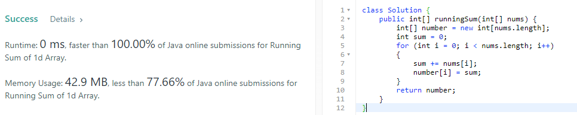
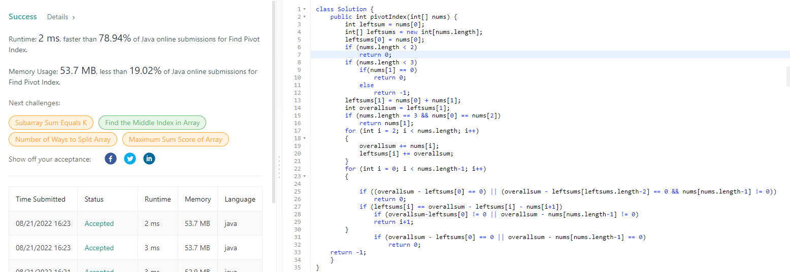
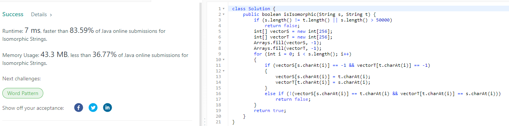
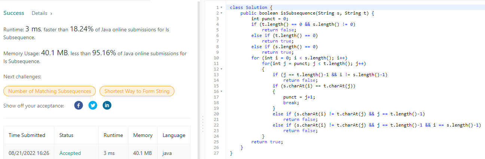

# LeetCode
## Table of contents
* [LeetCode 75](#LeetCode-75)
    * [1480 : Running Sum of 1d Array](#Running-Sum-of-1d-Array)
    * [724 : Find Pivot Index](#Find-Pivot-Index)
    * [205 : Isomorphic Strings](#Isomorphic-Strings)
    * [392 : Is Subsequence](#Is-Subsequence)
### LeetCode 75
#### Running Sum of 1d Array
 
[Code](src/RunningSumof1dArray.java)
#### Find Pivot Index

[Code](src/FindPivotIndex.java)
#### Isomorphic Strings

[Code](src/IsomorphicStrings.java)
#### Is Subsequence

[Code](src/IsSubsequence.java)