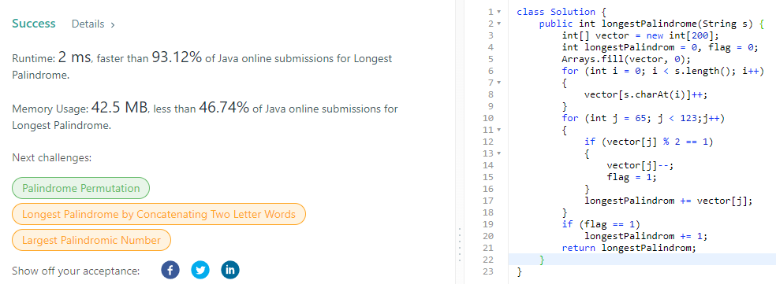

# LeetCode
## Table of contents
* [LeetCode 75](#LeetCode-75)
    * [1480 : Running Sum of 1d Array](#Running-Sum-of-1d-Array)
    * [724 : Find Pivot Index](#Find-Pivot-Index)
    * [205 : Isomorphic Strings](#Isomorphic-Strings)
    * [392 : Is Subsequence](#Is-Subsequence)
    * [21 : Merge Two Sorted Lists](#Merge-Two-Sorted-Lists)
    * [206 : Reverse Linked List](#Reverse-Linked-List)
    * [876 : Middle of the Linked List](#Middle-of-the-Linked-List)
    * [142 : Linked List Cycle II](#Linked-List-Cycle-II)
    * [121 : Best Time to Buy and Sell Stock](#Best-Time-to-Buy-and-Sell-Stock)
    * [409 : Longest Palindrome](#Longest-Palindrome)
* [Self-Chosen](#Self-Chosen)
  * [Array](#Array)
    * [66 : Plus One](#Plus-One)
    * [2011 : Final Value of Variable After Performing Operations](#Final-Value-of-Variable-After-Performing-Operations)
    * [2114 : Maximum Number of Words Found in Sentences](#Maximum-Number-of-Words-Found-in-Sentences)
    * [2239 : Find Closest Number to Zero](#Find-Closest-Number-to-Zero)
    * [11 : Container With Most Water](#Container-With-Most-Water)

---
## LeetCode 75

#### Running Sum of 1d Array
 
[Code](src/RunningSumof1dArray.java)

#### Find Pivot Index

[Code](src/FindPivotIndex.java)

#### Isomorphic Strings

[Code](src/IsomorphicStrings.java)

#### Is Subsequence

[Code](src/IsSubsequence.java)

#### Merge Two Sorted Lists

[Code](src/MergeTwoSortedLists.java) 
[Support Code](src/ListNode.java)

#### Reverse Linked List

[Code](src/ReverseLinkedList.java) 
[Support Code](src/ListNode.java)

#### Middle of the Linked List

[Code](src/MiddleoftheLinkedList.java) 
[Support Code](src/ListNode.java)

#### Linked List Cycle II

[Code](src/LinkedListCycleII.java) 
[Support Code](src/ListNode.java)

#### Best Time to Buy and Sell Stock

[Code](src/BestTimetoBuyandSellStock.java) 

#### Longest Palindrome

[Code](src/LongestPalindrome.java) 

---

## Self Chosen

### Array

---
#### Plus One
 
[Code](src/PlusOne.java)

#### Final Value of Variable After Performing Operations
 
[Code](src/FinalValueofVariableAfterPerformingOperations.java)

#### Maximum Number of Words Found in Sentences
 
[Code](src/MaximumNumberofWordsFoundinSentences.java)

#### Find Closest Number to Zero
 
[Code](src/FindClosestNumbertoZero.java)

#### Container With Most Water
 
[Code](src/ContainerWithMostWater.java)